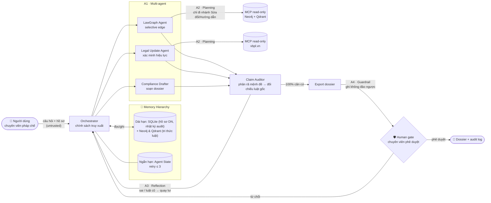

# G4 — Chuẩn bị Pitch Proposal (Thứ Tư 16/9, 18:00, B4-305)

> Nhóm G4: Đặng Lâm Tùng (trưởng) · Nguyễn Trung Phong · Vũ Việt Hưng
> Đề tài: **Agentic RAG cho hệ thống pháp luật Việt Nam** (Theme 9)
> Pitch: 3 phút trình bày + 2 phút thầy hỏi. Thứ tự G1→G8 → **G4 trình bày thứ 4**.

---

## A. KỊCH BẢN 3 PHÚT (đúng khung thời gian thầy yêu cầu)

**Ai nói:** 1 bạn trình bày (khuyến nghị Đặng Lâm Tùng — nắm kiến trúc), cả nhóm đứng cạnh để trả lời Q&A. Sơ đồ kiến trúc bắt buộc hiển thị trên slide.

### [0:00 – 0:30] Vấn đề & người dùng (30 giây)

> "Chào thầy và các bạn, nhóm G4 làm về **Agentic RAG cho hệ thống pháp luật Việt Nam**, hướng đến **chuyên viên pháp chế doanh nghiệp (SME)**.
> Vấn đề bài toán: Tra cứu pháp luật không chỉ là *tìm kiếm văn bản*, mà cốt lõi là *suy luận liên văn bản qua chuỗi sửa đổi/bổ sung và xác định tính hiệu lực theo dòng thời gian*. Trên 50% văn bản quy phạm bị sửa đổi theo thời gian; một câu hỏi thực tế đòi hỏi viện dẫn đồng thời Luật, Nghị định, Thông tư.
> Các baseline Graph-RAG mở rộng 1-hop cố định dễ gây loãng ngữ cảnh và giảm độ chính xác; đồng thời chưa có cơ chế kiểm chứng hiệu lực theo thời gian thực — tiềm ẩn nguy cơ trích dẫn luật đã bị bãi bỏ hoặc thay thế.
> Vì sao cần Multi-Agent: Không gian tra cứu phân nhánh động theo từng tình huống pháp lý phức tạp, vượt ngoài khả năng bao quát của các luồng xử lý cố định (hard-coded rules)."

### [0:30 – 1:30] Sơ đồ kiến trúc (60 giây) — CHỈ TAY VÀO SƠ ĐỒ

> "Kiến trúc là **1 Orchestrator đóng vai Supervisor + 4 sub-agent chuyên trách**. Orchestrator duy trì trạng thái chung và điều phối các tác tử độc lập; các sub-agent **không gọi chéo trực tiếp**. Vòng lặp điều phối diễn ra như sau:
> Người dùng gửi yêu cầu tư vấn và hồ sơ → Orchestrator tra cứu **memory** doanh nghiệp → lập **kế hoạch truy xuất**:
> - **LawGraph Agent** duyệt đồ thị Neo4j/Qdrant theo cơ chế *selective traversal* 3 bước: (1) trích xuất **metadata quan hệ** (loại quan hệ + số hiệu + trích yếu, không nạp trước toàn văn để tiết kiệm context), (2) **xếp hạng cạnh** (ưu tiên trọng số quan hệ *Sửa đổi > Bãi bỏ > Thay thế > Hướng dẫn* kết hợp độ liên quan ngữ nghĩa), (3) chỉ duyệt **1–2 nhánh có điểm cao nhất**, loại bỏ hoàn toàn việc nạp 1-hop ồ ạt;
> - **Legal Update Agent** tra cứu cổng `vbpl.vn` để **xác minh tính hiệu lực hiện hành theo thời gian thực**;
> - **Compliance Drafter** tổng hợp bản thảo hồ sơ tuân thủ;
> - **Claim Auditor** phân rã bản thảo thành các mệnh đề nguyên tử để đối soát nghiêm ngặt với điều luật nguồn. Nếu phát hiện thiếu căn cứ hoặc viện dẫn luật cũ → kích hoạt vòng lặp **yêu cầu truy xuất lại** (tối đa 3 chu kỳ);
> - Mọi hành động mang tính **tác động ngoại vi / không thể hoàn tác** (như nộp hồ sơ dịch vụ công) bắt buộc phải qua **Human Gate (chuyên viên phê duyệt)**.
>
> **Tools** nằm sau MCP server với 3 mức phân quyền: *read-only* (tra cứu luật), *reversible-write* (xuất báo cáo), *irreversible-write* (nộp hồ sơ, bắt buộc có người xác nhận).
> **Memory**:
> - **Ngắn hạn (In-memory State):** lưu ngữ cảnh phiên hội thoại và bộ đếm vòng lặp sửa (tối đa 3 lần).
> - **Dài hạn (SQLite `legal_advisory.db`):** lưu hồ sơ doanh nghiệp (vốn, ngành nghề) và nhật ký audit tư vấn.
> - **Kho tri thức pháp luật:** Qdrant (dense vector tìm Điều/Khoản) + Neo4j (đồ thị quan hệ Sửa đổi / Hướng dẫn / Thay thế).
> Trên sơ đồ đánh dấu **4 trục kỹ thuật**: Multi-agent · Planning & selective traversal · Reflection (Drafter–Auditor) · Security guardrails."

### [1:30 – 2:15] Kế hoạch đánh giá (45 giây)

> "Đánh giá trên **120 task**: 100 câu SBV (89 đơn văn bản + 11 chuỗi sửa đổi) + 10 kịch bản tuân thủ đa tầng + 5 soạn thảo + 5 ca tấn công.
> **Metric**: retrieval dùng Precision@2 / Recall / F2; câu trả lời dùng *strict correctness* — chấm đúng/sai bằng khớp điều khoản dẫn chiếu; và *grounding rate* — tỷ lệ mệnh đề có căn cứ, kiểm bằng SAFE/Ragas (LLM-as-a-judge). Kèm **latency ≤ 12s** và **chi phí ≤ $0.02/câu**.
> **So sánh**: 3 baseline (Naive RAG, SBV-LawGraph tĩnh, ReAct đơn agent) và **4 ablation** — bỏ Auditor, bỏ selective traversal, bỏ Legal Update Agent, hệ đầy đủ.
> Mỗi cấu hình chạy **3 seeds**, báo cáo **mean ± std**, và làm **error analysis**: phân loại lỗi theo *sai truy xuất / sai hiệu lực / mệnh đề không căn cứ / từ chối quá mức*.
> Tổng ~1.780 lần chạy, ~$3.2 — khoảng 13% ngân sách $25."

### [2:15 – 2:45] Threat model v0 (30 giây)

> "**Tài sản cần bảo vệ**: CSDL doanh nghiệp, nhật ký audit, tính toàn vẹn hồ sơ nộp cổng, API key.
> **Điểm vào của dữ liệu không tin cậy** có 3 nơi: hồ sơ người dùng tải lên, câu hỏi người dùng, và nội dung trả về từ công cụ/web bên ngoài.
> Kẻ tấn công có thể nhúng prompt injection gián tiếp trong PDF hoặc thao túng output công cụ.
> **Biện pháp chính**: least-privilege trên MCP — mọi thao tác ghi không đảo ngược bị chặn bởi cổng xác nhận người, kèm sanitizer đầu vào và **audit log toàn bộ tool call**. Chúng em có **10 ca tấn công**, gồm cả injection trực tiếp và gián tiếp, kiểm thử riêng."

### [2:45 – 3:00] Giả định rủi ro nhất + fallback (15 giây)

> "Giả định rủi ro nhất: `vbpl.vn` có thể tra cứu ổn định. Nếu sai, phạm vi thu hẹp: dùng metadata hiệu lực offline trong Neo4j + cache 24h, đánh giá trên snapshot có gắn nhãn ngày — hệ thống vẫn giữ đủ 4 trục."

---

## B. SƠ ĐỒ KIẾN TRÚC CHO SLIDE (bắt buộc hiển thị)

Dán Mermaid này (render tại mermaid.live → xuất PNG/SVG) hoặc vẽ lại bằng tay theo đúng thứ tự. Thầy cần thấy **vòng lặp**, **tools**, và **memory**.

> Nếu slide chật: gộp `Drafter` vào cột Auditor thành một khối "Draft → Audit loop", bỏ 2 nhãn phụ. Nhưng **giữ nguyên**: mũi tên quay lui Auditor→Orchestrator (vòng lặp), 2 hộp MCP (tools), 2 hộp memory.

---

## C. TRẢ LỜI 4 CÂU HỎI CHẤT LƯỢNG ĐỀ TÀI

Thầy hỏi 4 câu này **trước mọi câu hỏi kỹ thuật**. Trả lời ngắn, mỗi câu 20–40 giây.

### 1. MỚI — "Khác ví dụ gần nhất đã có ở chỗ nào?"
> "Các nghiên cứu đi trước như SBV-LawGraph và ViHERMES cung cấp nền tảng đồ thị tri thức pháp luật giá trị, nhưng các pipeline baseline thường mở rộng 1-hop cố định. G4 khác biệt ở 3 điểm: (1) chính sách duyệt đồ thị chọn lọc linh hoạt theo câu hỏi — *selective traversal* do tác tử quyết định; (2) kiểm tra hiệu lực thời gian thực qua cổng `vbpl.vn`; (3) vòng lặp phản biện đối soát Claim Auditor bảo đảm 100% mệnh đề có căn cứ pháp lý trước khi hoàn tất."

### 2. KHÔNG TẦM THƯỜNG — "Quyết định thiết kế khó nhất? Vì sao coding assistant không làm được trong 1 buổi chiều?"
> "Quyết định khó nhất là **chính sách truy xuất**: khi nào đi tiếp, đi theo nhánh nào, khi nào dừng và hỏi người dùng — phải cân bằng giữa đủ căn cứ và bùng nổ context. Một coding assistant không làm nổi trong buổi chiều vì cần tích hợp đồ thị Neo4j 5.221 node + cổng VBPL thật, và cần benchmark 120 task × 3 seeds để *chứng minh* thiết kế đó có lợi thật — chứ không phải chạy được là xong."

### 3. CÓ Ý NGHĨA — "Ai dùng, hoặc trả lời câu hỏi nghiên cứu nào?"
> "Người dùng là chuyên viên pháp chế SMEs. Nếu chạy hoàn hảo, nó trả lời câu hỏi nghiên cứu: *lập kế hoạch theo trạng thái + kiểm chứng có cải thiện grounding so với RAG cố định không?* Về ứng dụng: cắt giảm giờ tra cứu thủ công, và quan trọng nhất là ngăn doanh nghiệp trích dẫn điều khoản đã hết hiệu lực."

### 4. KHẢ THI — "Kế hoạch theo tuần vs ~10 tuần thực tế?"
> "W2–3: dựng đồ thị + harness đánh giá. W4–6: làm 4 sub-agent, MCP tools, Claim Auditor. W7: checkpoint demo 5 kịch bản + số liệu đầu. W8–10: hoàn thiện, chạy full benchmark 120 task × 3 seeds + 10 ca injection. W11–12: đóng gói (`run.sh`/Docker) + bảo vệ. Nền tảng sẵn có: corpus SBV và đồ thị Neo4j công khai [1]. Ngân sách ~$3.2 / mức $25."

---

## D. TRẢ LỜI "ĐỀ TÀI KHÁC G3/G8 Ở ĐÂU?"

> ⚠️ Nguyên tắc: **chỉ nói về mình, không đoán về nhóm khác.** Đối chiếu theo 3 trục: **task (làm gì) → cơ chế lõi (khác gì) → đánh giá (chứng minh gì).**

> "Ba nhóm cùng chọn RAG pháp luật, nhưng G4 chúng em khác ở **đối tượng bài toán** và **3 cơ chế**:
> 1. **Phạm vi**: không làm chatbot hỏi đáp pháp luật chung, mà làm **hệ thống tuân thủ cho doanh nghiệp** — đầu ra là dossier/ma trận tuân thủ có kiểm chứng từng mệnh đề.
> 2. **Cơ chế lõi 1 — temporal verification**: vòng lặp tra `vbpl.vn` theo thời gian thực để chặn trích dẫn luật hết hiệu lực.
> 3. **Cơ chế lõi 2 — Drafter–Auditor grounding loop**: bắt buộc 100% mệnh đề có căn cứ trước khi xuất.
> 4. **Cơ chế lõi 3 — human-gated irreversible actions**: nộp hồ sơ qua cổng có xác nhận người.
> Nếu thầy cho xem cụ thể hai nhóm kia, em đối chiếu ngay theo 3 trục: task, cơ chế, đánh giá."

---

## E. KẾT QUẢ RÀ SOÁT PROPOSAL THEO R2/R4/R5/R6

| Yêu cầu | Trạng thái | Ghi chú |
|---|---|---|
| **R2** Tools/MCP + phân quyền | ✅ Đạt (cần chỉnh nhẹ) | 6 tools, 3 mức quyền rõ. Nhưng nên nói thẳng: "Neo4j/Qdrant và VBPL là **2 MCP server**; phân quyền thực thi tại lớp MCP/gateway" — tránh để thầy nghĩ chỉ là function-calling thường. |
| **R4** ≥ 3 trục kỹ thuật | ✅ Đạt (lỗi đánh số) | 4 trục đủ. **Section 4 đánh số nhảy 1→2→4, thiếu số 3** (Reflection nằm ẩn trong ablation). Sửa lại: 1 Multi-Agent · 2 Planning & Selective Traversal · 3 Reflection (Drafter–Auditor) · 4 Guardrails. Tách mục Ablation khỏi danh sách trục. |
| **R5** Đánh giá định lượng | ⚠️ Thiếu 1 mục | Đủ: 120 task ≥ 20, metric, cost/latency, 4 ablation, 3 seeds. **Thiếu "error analysis"** — R5 yêu cầu tường minh. |
| **R6** Threat model | ⚠️ Cần bổ sung | Có assets + 10 ca tấn công + phân quyền + audit log. **Thiếu tường minh "entry points" và "attacker capabilities"**; 10 ca chưa gắn nhãn **direct vs indirect**. |

### Các sửa cần làm trong proposal (gợi ý chính xác)

1. **R5 — thêm mục "Error analysis" (7.x)**: taxonomy lỗi 4 loại — (a) retrieval-miss, (b) sai hiệu lực/phiên bản luật, (c) mệnh đề không căn cứ (citation hallucination), (d) từ chối quá mức / không hỏi dữ kiện thiếu. Kèm cách làm: lấy mẫu 30 câu trả lời sai, phân loại thủ công, báo bảng phân bố.

2. **R6 — bổ sung 2 mục trong Section 8**:
   - *Entry points*: (1) file hồ sơ người dùng tải lên, (2) câu hỏi người dùng, (3) output của công cụ web/gazette, (4) dữ liệu trong cache/memory.
   - *Attacker capabilities*: kẻ tấn công **có thể** soạn tài liệu + thao túng output công cụ bên ngoài; **không thể** truy cập trực tiếp CSDL nội bộ, không thể vượt cổng xác nhận người.

3. **R6 — gắn nhãn direct/indirect** cho 10 ca: case 1 (chữ ẩn trong PDF) = **indirect**; thêm 1 ca indirect qua output công cụ gazette bị nhiễm độc để chắc chắn ≥ 2 ca indirect.

4. **R4 — sửa đánh số trục** như bảng trên.

5. **Vệ sinh cấu trúc**: Section "7. Related Systems" đang chứa mục 6.1–6.4; cuối file có 2 mục risk trùng lặp (8.1/8.2 xuất hiện 2 lần với bảng chi phí 2 phiên bản khác nhau). Gộp bỏ trùng, sửa numbering cho gọn (không mất điểm, nhưng tránh gây nhiễu khi thầy đọc).

---

## F. DỰ PHÒNG CÂU HỎI KỸ THUẬT THƯỜNG GẶP

- **"Sao tách nhiều agent mà không dùng 1 agent ReAct?"** → "Vì mỗi vai cần context và ràng buộc riêng: Claim Auditor không được sinh nội dung, chỉ được đối chiếu; Compliance Drafter không được quyết định truy xuất. Tách vai để cô lập trách nhiệm, dễ kiểm thử và gắn quyền tool theo từng vai."
- **"Làm sao biết selective traversal không bỏ sót điều khoản?"** → "Đo bằng Recall@k so với expansion 1-hop đầy đủ trong ablation — chấp nhận đánh đổi recall để tăng Precision@2 và giảm context; chính là trade-off R5 yêu cầu làm rõ."
- **"Grounding rate đo thế nào cho khách quan?"** → "Dùng SAFE/Ragas LLM-as-a-judge (Gemini) bóc mệnh đề và đối chiếu căn cứ, kèm 1 mẫu chấm tay để tính agreement."
- **"Vì sao Google ADK mà không LangGraph?"** → "ADK cho runner/session sẵn; logic chính sách truy xuất và vòng Drafter–Auditor tự viết bằng tay — report sẽ nói rõ phần nào do framework, phần nào tự build."
- **"Chi phí $3.2 có chắc không?"** → "Là ước tính theo token ở mục 9.3; report cuối sẽ báo actual spend. Dev dùng Ollama Qwen 2.5 local = $0, chỉ trả tiền cho các lần chạy benchmark ghi vào report."

---

- **"Memory ngắn hạn và dài hạn khác nhau thế nào, lưu ở đâu?"** → "Ngắn hạn là **Agent State** chỉ sống trong phiên (ngữ cảnh tra cứu, bản nháp, log đối soát, retry ≤ 3). Dài hạn lưu trên **SQLite (`legal_advisory.db`)** gồm: hồ sơ doanh nghiệp, nhật ký đối soát (audit logs), và bộ đệm trạng thái văn bản (TTL 24h để không spam web vbpl.vn). Còn **Neo4j và Qdrant** là kho tri thức tĩnh phục vụ tra cứu đồ thị quan hệ và ngữ nghĩa của 1.703 văn bản luật."
- **"Context của mỗi agent quản lý thế nào?"** → "Mỗi sub-agent có context riêng, chỉ nhận đúng việc được giao; agent trả về **tóm tắt** (ID điều khoản, verdict, 1–3 dòng) chứ không ném toàn văn cho nhau. Bằng chứng bị chặn trần (top-k = 5, sâu 2, ≤ 5 văn bản) nên context mỗi agent có trần theo thiết kế. Claim Auditor không có tool nào."

## G. CHECKLIST TRƯỚC GIỜ HỌC

- [ ] Sơ đồ kiến trúc: có **vòng lặp** (mũi tên quay lui), **tools/MCP**, **memory**, và **4 nhãn trục**.
- [ ] Không cắt phần ĐÁNH GIÁ khi phải rút ngắn — cắt related work trước.
- [ ] Người trình bày bấm giờ 3 phút; có người cầm đồng hồ báo khi còn 30 giây.
- [ ] 4 câu chất lượng + câu "khác G3/G8" đã thuộc (mục C, D).
- [ ] Chuẩn bị trước giọng trả lời: nếu thầy chỉ yêu cầu **chỉnh sửa**, ghi lại từng điểm được nêu để sửa đúng 3 ngày.
