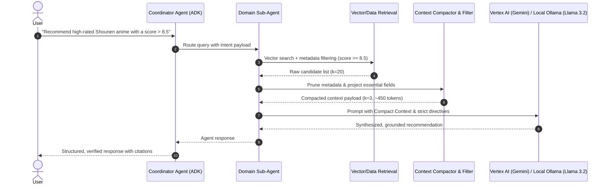

# CO5151
CO5151 HCMUT
# Context Engineering & Agent RAG Architectural Guide
### High-Performance Retrieval, Metric Evaluation (Ragas & Industry Standards), System Design & Google ADK Guide (with Local Ollama Setup)

> **Documentation**: Explore the complete [LegalPilot-VN Documentation](docs/README.md) for [Architecture Decision Records (ADRs)](docs/adr/README.md), [Architecture Overview](docs/architecture/overview.md), and [Developer Guides](docs/development/getting-started.md).

---

## 1. What is RAG (Retrieval-Augmented Generation)?

**Retrieval-Augmented Generation (RAG)** is an AI architectural pattern that grounds Large Language Models (LLMs) on external, dynamic, and authoritative knowledge sources before generating responses.

```
┌─────────────────────────────────────────────────────────────────────────────────────────────────────────┐
│                                          THE RAG LIFECYCLE                                              │
├───────────────────────────┬─────────────────────────────────────────────┬───────────────────────────────┤
│ 1. Indexing & Ingestion   │ 2. Retrieval & Context Engineering          │ 3. Augmented Generation       │
├───────────────────────────┼─────────────────────────────────────────────┼───────────────────────────────┤
│ Documents / DBs           │ User Query                                  │ System Prompt + Context + Q   │
│   ▼                       │   ▼                                         │   ▼                           │
│ Chunks -> Embedding Model │ Dense / Hybrid / SQL / NoSQL Search         │ LLM (Gemini / Llama / Qwen)   │
│   ▼                       │   ▼                                         │   ▼                           │
│ Vector Database (Chroma)  │ Filter • Prune • Rerank • Context Pack      │ Grounded, Hallucination-Free  │
└───────────────────────────┴─────────────────────────────────────────────┴───────────────────────────────┘
```

### Why RAG is Essential for Enterprise & Agent Systems
1. **Overcomes Knowledge Cutoffs:** Equips pre-trained models with real-time, mutable private datasets without retraining.
2. **Eliminates Hallucinations:** Forces the model to synthesize answers strictly from verifiable context passages with source citations.
3. **Data Privacy & Access Control:** Enables role-based access control (RBAC) at the retrieval layer—users only retrieve documents they are authorized to view.
4. **Cost & Agility vs Fine-Tuning:** Updating knowledge requires indexing new chunks into a vector/NoSQL store in seconds, avoiding expensive model fine-tuning runs.

### Architectural Comparison

| Dimension | Standard LLM Prompting | Fine-Tuning (SFT) | RAG (Retrieval-Augmented) |
| :--- | :--- | :--- | :--- |
| **Knowledge Source** | Static weights only | Baked into model weights | Dynamic external databases |
| **Update Frequency** | Requires retraining | Slow, costly retraining | **Instant (Real-time DB update)** |
| **Hallucination Risk** | High | Medium | **Near Zero (When grounded)** |
| **Traceability & Citations** | None | None | **Full (Direct chunk citations)** |
| **Cost** | Low inference cost | Very high training cost | **Predictable & Scalable** |

---

## 2. Context Engineering in RAG

**Context Engineering** is the discipline of strategically extracting, structuring, compressing, and formatting retrieved information before injecting it into the LLM prompt payload.

```
┌─────────────────┐      ┌─────────────────────────┐      ┌─────────────────────────┐      ┌──────────────────┐
│   User Query    │ ───► │  Retrieval Engine       │ ───► │   Context Engineering   │ ───► │  LLM Generation  │
│                 │      │  (Vector / SQL / NoSQL) │      │  Filter • Project • Pack│      │  (Grounded Resp) │
└─────────────────┘      └─────────────────────────┘      └─────────────────────────┘      └──────────────────┘
```

### The Core Problem: Context Contamination & "Lost in the Middle"
Passing raw, unpruned database outputs directly into prompt payloads degrades LLM reasoning due to three main failure modes:
1. **Attention Dispersion / Lost in the Middle:** Transformer self-attention mechanisms degrade when critical facts are buried amidst boilerplate or irrelevant schema fields.
2. **Token Bloat & Latency Inflation:** Unfiltered JSON dumps (e.g. nested IDs, raw URLs, timestamps) consume prompt tokens linearly with multi-turn conversations, causing quadratic time-to-first-token (TTFT) and severe cost expansion.
3. **Hallucination Vectors:** Out-of-date or conflicting context documents encourage model extrapolation rather than strictly grounded answering.

---

## 3. Taxonomy of Context Engineering Techniques

| Technique | Description | Impact | Code / Architectural Pattern |
| :--- | :--- | :--- | :--- |
| **1. Selective Schema Projection** | Prune non-essential keys, internal metadata, and verbose attributes from database responses. | Cuts token payload by **60–80%**; eliminates field noise. | `project_fields(doc, ["title", "score", "synopsis"])` |
| **2. Two-Stage Write & Select** | Retrieve broad candidate pool ($k=20$) via dense/hybrid search, then re-rank and inject only top $k=3-5$ items into prompt context. | Elevates Context Precision (MAP@K) by **>200%**. | Cross-encoder or LLM-based reranking filter. |
| **3. In-Flight Context Compaction** | Summarize or compress older conversational turns while preserving active entities and slot-filling variables. | Prevents multi-turn context drift; maintains $O(1)$ token growth. | Redis / InMemory session compressor with entity state tracker. |
| **4. Canonical Normalization** | Type-cast numeric fields (e.g., float scores), normalize strings (lowercase/strip), and resolve cross-lingual entities. | Guarantees deterministic LLM numeric filtering and entity recall. | Pre-indexing canonical pipeline. |
| **5. Temperature Directives & Strict Grounding** | Enforce $T \le 0.2$ and explicit prompt contracts (*"Answer ONLY using provided context"*). | Suppresses hallucinations; maximizes Ragas Faithfulness score. | System instructions with strict negative constraints. |

---

## 4. RAG Evaluation Metrics & Industry Reference Suite

To quantitatively validate Context Engineering optimizations, multi-dimensional evaluation suites must be employed:

```
                  ┌──────────────────────────────────────────────┐
                  │              RAG Evaluation Triad            │
                  └──────────────────────────────────────────────┘
                                  ▲               ▲
                                  │               │
                     Faithfulness │               │ Answer Relevance
                                  ▼               ▼
    ┌───────────────────────┐          ┌───────────────────────┐
    │   Retrieved Context   │          │   Generated Answer    │
    └───────────────────────┘          └───────────────────────┘
                  ▲                               
                  │ Context Precision / Recall    
                  ▼                               
    ┌───────────────────────┐                     
    │  Ground Truth / Query │                     
    └───────────────────────┘                     
```

### A. Ragas Metric Suite (Official Framework)

1. **Context Precision (MAP@K):**
   Evaluates whether the most relevant documents appear at the top of the retrieved context:
   $$\text{Context Precision@K} = \frac{\sum_{k=1}^K (\text{Precision@}k \times v_k)}{\text{Total Relevant Items in Top } K}$$
   *Where $v_k \in \{0, 1\}$ denotes whether chunk $k$ is relevant.*

2. **Context Recall:**
   Measures how thoroughly the retrieved context covers the ground truth reference:
   $$\text{Context Recall} = \frac{|\text{Ground Truth Sentences Attributed to Context}|}{|\text{Total Ground Truth Sentences}|}$$

3. **Context Entity Recall:**
   Calculates the fraction of named entities in the reference answer that appear in the context payload:
   $$\text{Context Entity Recall} = \frac{|E_{\text{ground\_truth}} \cap E_{\text{context}}|}{|E_{\text{ground\_truth}}|}$$

4. **Faithfulness (Groundedness):**
   Validates whether all claims in the generated answer are strictly inferred from the provided context (anti-hallucination metric):
   $$\text{Faithfulness} = \frac{|\text{Verified Claims in Answer}|}{|\text{Total Claims Made in Answer}|}$$

5. **Answer Relevance:**
   Computes the mean cosine similarity between the user's initial query embedding and synthetic queries generated from the model's answer:
   $$\text{Answer Relevance} = \frac{1}{N} \sum_{i=1}^N \cos(\mathbf{e}_{\text{orig\_query}}, \mathbf{e}_{\text{gen\_query}_i})$$

---

### B. Industry Reference Evaluation Frameworks

* **TruLens (TruEra RAG Triad):** Evaluates Context Relevance, Groundedness, and Answer Relevance using feedback functions and instrumented execution traces.
* **ARES (Automated RAG Evaluation System):** Utilizes synthetic query/document generation and fine-tuned lightweight LLM judges with statistical confidence bounds.
* **G-Eval (DeepEval / LLM-as-a-Judge):** Uses explicit multi-step Chain-of-Thought (CoT) scoring rubrics with form-filling grading matrices.
* **BEIR / MTEB Benchmark Standards:** Zero-shot information retrieval benchmarking datasets across diverse domains (BioASQ, NFCorpus, TREC-COVID, FiQA).

---

## 5. High-Level Data Design for Agent RAG Chatbots

### A. Multi-Collection Vector & Metadata Storage
For complex domains (e.g. Anime, Travel, Enterprise Data), decouple data into purpose-built vector and relational stores rather than a single monolithic index:

```
┌─────────────────────────────────────────────────────────────────────────────┐
│                             Storage Layer Architecture                      │
├───────────────────────────────┬─────────────────────────────┬───────────────┤
│ Vector Collections (ChromaDB) │ Structured Metadata (NoSQL) │ Graph / SQL   │
├───────────────────────────────┼─────────────────────────────┼───────────────┤
│ • collection_synopsis         │ • documents (MongoDB)       │ • relational  │
│   (Semantic embeddings)       │   (Full JSON specs)         │   (Scores,    │
│ • collection_reviews          │ • session_history (Redis)   │   Dates,      │
│   (Sentiment & long text)     │   (In-flight compressed)    │   Relations)  │
└───────────────────────────────┴─────────────────────────────┴───────────────┘
```

### B. End-to-End Chatbot Runtime Sequence



---

## 6. Google ADK (Agent Development Kit) Installation & Guide

Google's **Agent Development Kit (`google-adk`)** is a lightweight, modular orchestration framework that supports both cloud models (Vertex AI / Gemini) and **local models (Ollama, vLLM, LocalAI)**.

### A. Installation & Dependencies

```bash
# Install core ADK, LiteLLM router, and GenAI SDK
pip install google-adk==2.3.0 \
            google-genai==2.9.0 \
            google-adk-community==0.5.0 \
            litellm==1.84.0 \
            openinference-instrumentation-google-adk>=0.1.6 \
            ragas==0.4.3 \
            fastapi==0.133 \
            uvicorn==0.38.0
```

---

### B. Option 1: Cloud Deployment (Google Cloud Vertex AI)

Configure Vertex AI credentials:

```bash
export GOOGLE_GENAI_USE_VERTEXAI=1
export GOOGLE_CLOUD_PROJECT="your-gcp-project-id"
export GOOGLE_CLOUD_LOCATION="global"  # Or us-central1
```

```python
from google.adk.agents import Agent
from google.genai.types import GenerateContentConfig

agent = Agent(
    model="gemini-2.5-flash",
    name="cloud_rag_agent",
    instruction="Answer strictly using retrieval context.",
    generate_content_config=GenerateContentConfig(temperature=0.2),
)
```

---

### C. Option 2: Local Deployment with Ollama & Local Models

> [!TIP]
> **Can ADK work with Ollama or local LLMs?**
> **YES.** Google ADK can execute against local models via two proven patterns:
> 1. **LiteLLM Proxy Router (Recommended):** Bridges Ollama's local engine to ADK via OpenAI-compatible endpoints with standard tool-calling support.
> 2. **Direct OpenAI-Compatible Base URL:** Points ADK or `google-adk-community` directly to Ollama's native `/v1` endpoint.

#### Step 1: Install and Run Ollama
Download and run your desired model locally:
```bash
# Install Ollama (Linux/macOS)
curl -fsSL https://ollama.com/install.sh | sh

# Pull and start local LLM (e.g., Llama 3.2 or Qwen 2.5)
ollama pull llama3.2
ollama pull nomic-embed-text  # Local embedding model for ChromaDB
ollama serve                  # Runs API on http://localhost:11434
```

#### Step 2: Start LiteLLM Proxy Bridge
Run the proxy to provide a standardized tool-calling endpoint for ADK:
```bash
# Start LiteLLM proxy pointing to local Ollama
litellm --model ollama/llama3.2 --port 8000
```

#### Step 3: Configure ADK with Local Model Endpoint
```python
"""ADK Agent running on local Ollama / LiteLLM Proxy."""

import os
from google.adk.agents import Agent
from google.adk.runners import Runner
from google.adk.sessions import InMemorySessionService
from google.genai.types import GenerateContentConfig
from google.genai import types
import asyncio

# Point environment to local LiteLLM proxy
os.environ["OPENAI_API_BASE"] = "http://localhost:8000/v1"
os.environ["OPENAI_API_KEY"] = "sk-local-key"  # Dummy key for local proxy

# 1. Define Context-Engineered Local Retrieval Tool
def search_local_knowledge(query: str, top_k: int = 3) -> dict:
    """Retrieves context from local ChromaDB."""
    return {
        "status": "success",
        "results": [
            {"title": "Fullmetal Alchemist: Brotherhood", "score": 9.1, "summary": "Brothers Edward and Alphonse seek the Philosopher's Stone."}
        ]
    }

# 2. Instantiate ADK Agent targeting Local Ollama
local_rag_agent = Agent(
    model="openai/llama3.2",  # Routed via local LiteLLM proxy
    name="local_rag_agent",
    description="Local agent powered by Ollama Llama 3.2",
    instruction="Answer queries strictly based on search_local_knowledge.",
    generate_content_config=GenerateContentConfig(
        temperature=0.1,
        max_output_tokens=1024,
    ),
    tools=[search_local_knowledge],
)

# 3. Asynchronous Runner Execution Loop
async def run_local_agent(user_prompt: str):
    session_service = InMemorySessionService()
    runner = Runner(
        agent=local_rag_agent,
        app_name="local_rag_app",
        session_service=session_service,
    )
    session = await session_service.create_session(app_name="local_rag_app", user_id="local_user")
    msg = types.Content(role="user", parts=[types.Part(text=user_prompt)])
    
    async for event in runner.run_async(user_id="local_user", session_id=session.id, new_message=msg):
        if event.content and event.content.parts:
            for part in event.content.parts:
                if part.text:
                    print(part.text, end="", flush=True)

if __name__ == "__main__":
    asyncio.run(run_local_agent("What is Fullmetal Alchemist about?"))
```

---

### D. Observability & Tracing with OpenTelemetry & Langfuse

Enable zero-code OpenTelemetry tracing for ADK agents across both Vertex AI and Ollama:

```python
from openinference.instrumentation.google_adk import GoogleADKInstrumentor
from opentelemetry import trace
from opentelemetry.sdk.trace import TracerProvider

# Initialize provider and instrument ADK
provider = TracerProvider()
trace.set_tracer_provider(provider)
GoogleADKInstrumentor().instrument()
```

---

## 7. Summary Checklist for Agent RAG Deployments

- [x] **Clear RAG Foundation:** Ground model reasoning on vector/NoSQL stores with strict attribution.
- [x] **Payload Optimization:** Apply JSON key projection before passing retrieval results to LLMs.
- [x] **Strict Prompts & Low Temperature:** Lock $T \le 0.2$ and specify negative constraints against extrapolation.
- [x] **Automated Ragas Evaluation:** Continuously evaluate against Faithfulness, Context Precision (MAP@K), and Answer Relevance.
- [x] **Model Agnosticism (Cloud & Local):** ADK can seamlessly target **Vertex AI Gemini** for cloud or **Ollama (Llama 3.2 / Qwen 2.5)** via LiteLLM for zero-cost local execution.
- [x] **Session State Compaction:** Implement in-flight session history compression for long-running multi-turn conversations.
